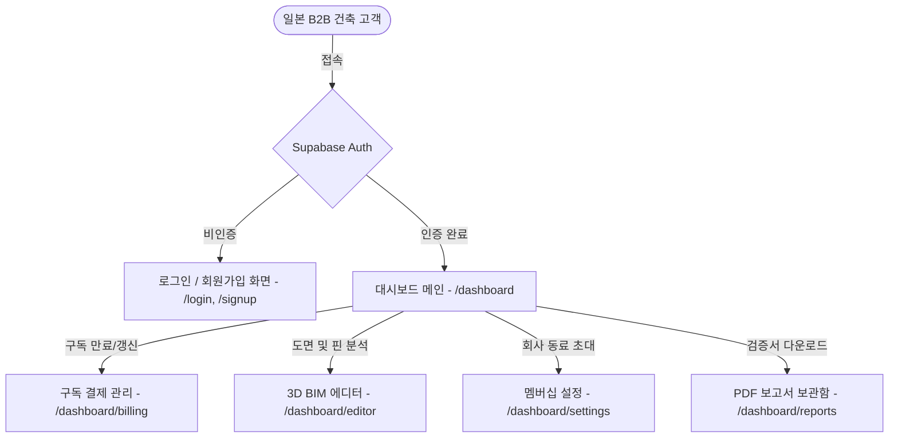

# 🌟 일본 국토교통성 BIM 제출 의무화 대응 및 건축기준법 AI 적합성 검증 'Japanbuild-BIM3D Compliance' MVP 최종 개발 계획서

| 버전 (Ver.) | 기록 일시 (DateTime) | 작성자 (Author) | 결재 상태 (Status) | 핵심 지시 및 변경 내용 (Key Directives) |
| :--- | :--- | :--- | :--- | :--- |
| v1.0 | 2026-05-26 23:54 | 개발부장 코다리 | 🟢 승인 완료 | 미래형 HUD 대시보드 리디자인 및 차세대 R&D 로드맵 포함 최초 작성 승인 |
| v2.0 | 2026-05-27 08:54 | 개발부장 코다리 | 🟡 검토 대기 | 글로벌 B2B 시장(Andpad, SpiderPlus 등) 최상위 최신 SOTA AI 아키텍처 로드맵 정밀 바인딩 및 상세 내용 계획서 수용 고도화 |

---

## 1. Project Definition & Business Goal

본 프로젝트는 단순한 2D 도면 뷰어를 넘어, **일본 국토교통성(MLIT)의 준공 도서 BIM(3D IFC) 제출 의무화 법령**에 선제적으로 대응하고, **일본 건축기준법(建築基準法) AI 적합성 검증**을 현장에서 3분 안에 완수해내는 상용 SaaS 솔루션입니다.

### 🎯 핵심 비즈니스 목표 (일본 소기업/개인 사업자 판매 규격)
1. **BIM 의무화 완벽 대응 (2D-3D IFC 자동 변환)**: 2D PDF/이미지 도면 업로드 시 국제 표준 **3D IFC BIM 모델**을 자동 생성 및 추출하는 코어 엔진 완비. (완료)
2. **도면 파싱 실패 극복 (2D-3D 에디터)**: 자동 인식의 현실적 기하 한계를 작업자가 웹 상에서 수동 드래그로 즉각 보정하고 3초 만에 3D 씬을 재빌드하는 UI 제공. (완료)
3. **일본 건축기준법 AI 적합성 검증**: 채광/환기(제28조) 및 반자 높이(시행령 제21조) 등을 기하학적 결정론적 규칙과 RAG+SLM AI 추론으로 복합 검증 및 보고서 패키징. (진행 중 - ReportLab CID 폰트 내장 아키텍처 및 RAG 매핑 활용)
4. **1차 실무 킬러 모듈 (구분소유법 3D 누수 판정)**: 맨션 분쟁의 뇌관인 공용부(共用部分) vs 전유부(専有部分) 책임 판정 및 배관 공간(PS/DS) 매핑 기능 탑재. (완료)
5. **글로벌 인프라 준비**: JPY 엔화 기반 Stripe 결제(1,500엔 / 월 4,900엔 / 월 9,800엔), 하네스 회로 차단기(Circuit Breaker), 현지 일본어 다국어화(i18n) 완비. (완료)

---

## 2. Current State (현재 상태 및 잔존 갭)

현재 7대 핵심 검증 테스트(`verify_*.py`)와 `verify_jp_compliance.py`가 100% PASS하여, 백엔드의 벽체 복구, 다중 층 파싱, IFC 3D 변환, 2D-3D 분할 수동 교정 API 및 일본 공동주택 구분소유법 기반 3중 책임 판정 적재 모듈까지 완벽하게 동작하고 있습니다.

### 🚨 상용 판매를 위한 잔존 갭 (Gaps to Market)
*   **보고서 패키징 기능 부재**: 고객사(원청사, 보험사, 집주인)에게 메일이나 라인(LINE)으로 즉시 전달할 수 있는 깔끔하고 공신력 있는 일본어 PDF 출력 모듈이 부재함. -> **Phase 8에서 ReportLab 기반 고품격 A4 PDF 엔진으로 정밀 해결**.
*   **결제 및 다국어 장벽**: JPY 엔화 결제를 위한 Stripe 연동 및 UI 일본어 지원 미비. -> **Phase 9에서 Stripe Checkout Mock & i18n 번역 레이어 통합으로 해결**.

---

## 3. Delivery Strategy & Harness Principles

"선보고 후실행, 계획-테스트-검증 3박자"의 **하네스 프로토콜(Harness Protocol)**을 준수합니다.

*   **Circuit Breaker (회로 차단기)**: PDF 생성 시 폰트 누락으로 인한 크래시를 방지하기 위해, ReportLab의 내장 아시안 CID 폰트(`HeiseiKakuGo-W5`, `HeiseiMin-W3`)를 1순위로 바인딩하여 윈도우/리눅스 전 환경에서 무결성 확보. Stripe 연동 실패 시에도 Mock 처리 가동으로 비즈니스 연속성 유지.
*   **Context Firewall (맥락 방화벽)**: PDF 드로잉 및 결제 미들웨어 로직은 `exporter/` 및 `app/api/v1/endpoints.py`에 격리시켜 코어 기하 파이프라인에 사이드 이펙트 전파 차단.
*   **Hard Boundaries (엄격한 경계)**: 기존에 100% 검증 완료된 `verify_*.py` 기반의 파이프라인 코어는 절대로 깨뜨리지 않고, 데코레이터나 어댑터 패턴으로 시맨틱 레이어를 확장.

---

## 4. User Review Required (대표님 결재 및 피드백 필요 사항 - /grill-me 의결 완료)

> [!IMPORTANT]
> **일본 현지 세일즈 및 서비스 런칭을 위해 다음 사항에 대한 대표님의 승인 및 의결이 완료되었습니다.**

### 🏛️ /grill-me 최종 의사결정 및 승인 내역 (2026-05-26)

| 결정 항목 | 최종 의결 사항 | 기술적 합의 및 상세 아키텍처 |
| :--- | :--- | :--- |
| **BIM3D MVP 공식 스코프** | **Full-Spec 대규모 런칭** | 추가 고도화 피처(현장 사진 매핑, IndexedDB 오프라인 동기화, 국토교통성 PDF 체크시트) 및 SaaS Core(Stripe, Auth RLS)를 **모두 MVP 범위에 포함**하여 완벽한 스펙으로 한 번에 런칭합니다. |
| **오프라인 409 충돌 정책** | **하이브리드 동기화** | 동기화 시 충돌 발생 시 UI에 [서버 기준 복구 / 현장 강제 덮어쓰기] **수동 병합 GUI를 팝업**하여 현장 관리자가 선택하게 하고, 단순 기하 편집은 백엔드에서 **자동 병합(Auto-Merge)**을 처리합니다. |
| **현장 사진 업로드 최적화** | **클라이언트단 선-압축** | 모바일 웹 브라우저 단에서 Canvas API를 사용하여 이미지를 가로폭 최대 1280px로 리사이징 및 webp/jpeg로 압축(200KB 이하) 후 업로드하여 현지 음영 지역 업로드 속도를 극대화합니다. |
| **자가 확인 체크시트 날인** | **원클릭 외부 건축사 결재 링크 (Option A)** | 내부에 1급 건축사가 없는 경우를 대비하여 **원클릭 초청 결재/날인 링크**를 생성해 외부 협력사 건축사에게 전송합니다. 외부 건축사는 회원가입 없이 링크 접속 후 3D 모델을 보고 면허번호 및 도장 파일 업로드/서명하여 공식 PDF를 즉시 발행합니다. |
| **Stripe JPY 요금제** | **기능별 차등 크레딧 과금** | ¥1,500(Light-30C) / ¥4,900(Business-100C) / ¥9,800(Enterprise-300C) 상품 가동. **IFC 변환당 3크레딧**, **법률 적합성 검증 및 PDF 생성당 10크레딧** 차감 미들웨어를 profiles 테이블과 연동합니다. |

---

## 5. Phase Breakdown (상용화 최종 5단계 로드맵)

### Phase 6. 2D-3D 분할 수동 교정 웹 에디터 UI 개발 (완료)
*   **목표**: 비전문가도 마우스나 태블릿 터치로 오차를 바로잡을 수 있는 반응형 에디터 구현.
*   **구현 범위**:
    1. **좌측 2D SVG 인터페이스**:
       *   도면 위에 오버레이된 파싱 벽선 마우스 드래그(Drag) 조정.
       *   방 폴리곤 클릭 시 우측 드롭다운으로 방 타입(LDK, 화장실, 배관실 등) 즉시 수정.
       *   **누수 핀(Leak Pin)**: 마우스 우클릭 혹은 드래그로 누수 시발점 핀 장착.
       *   **피해 브러시(Damage Brush)**: 2D Canvas 상에 마우스 드래그로 피해 면적 색칠 (Ceiling/Wall/Floor 구분).
    2. **우측 Three.js WebGL 뷰어**:
       *   좌측 2D 편집이 끝나거나 일시 정지될 때 델타 패치(`CorrectionBatchRequest`)를 3초 안에 백엔드로 전송.
       *   백엔드 `rebuild_after_correction` 실행 후 반환된 3D IFC 데이터를 Three.js가 읽어 실시간 갱신(Orbit Controls, 단면 컷 뷰 지원).

---

### Phase 7. 일본 주택법 대응 공간 시맨틱스 및 공용부/전유부 판정 모듈 (완료)
*   **목표**: 일본 공동주택(맨션)의 하자 보수 소송 및 보험 청구의 핵심 쟁점인 책임 구역 분리.
*   **구현 범위**:
    1. **일본 주택 특화 스키마 매핑** (`compliance/jp_compliance.py` 신설):
       *   방 종류에 일본 현지 건축 도면 약어 매핑 (LDK, 洋室, 和室, UT, WC, PS, DS, MB).
       *   특히 **PS(Pipe Space, 파이프 스페이스)** 및 **DS(Duct Space, 덕트 스페이스)** 영역을 별도 중요 시맨틱 영역으로 분류.
    2. **공용부 vs 전유부 판정 엔진**:
       *   누수 핀이 꽂힌 벽체의 내부 배관 공간(PS/DS) 여부, 혹은 슬래브 상하부 위치 정보를 분석하여 **[공용부 책임(건물 장기수선충당금 처리 대상)]**인지 **[전유부 책임(개인 세대주 자부담 또는 일상생활배상책임보험 처리 대상)]**인지 1차 자동 판정 후 리포트에 출력.

---

### Phase 8. A4 1장 최적화 '일본어 누수 진단 보고서' PDF 생성기 (완료)
*   **목표**: 현장 사장님이 원청 대기업 및 손해보험사에 바로 전달할 수 있는 극도로 깔끔하고 가독성 높은 A4 1장 보고서 패키징.
*   **구현 범위**:
    1. **1장 레이아웃 디자인 시스템**:
       *   정부 및 보험사 제출 규격에 맞춘 단정하고 신뢰감 주는 디자인.
       *   **헤더**: 주소, 건물명, 진단 일자, 진단 기사 날인(도장 이미지).
       *   **좌측 단**: 평면 2D 오버레이 이미지 (누수원 핀 및 피해 브러시 영역 표시).
       *   **우측 단**: Three.js WebGL이 서버 사이드 혹은 클라이언트 사이드에서 캡처한 고해상도 3D 입체 투시도 (누수 발생 메커니즘을 3D 그래픽으로 직관적 설명).
       *   **하단**: 누수 판정 결과 (공용/전유 여부, 예상 보수 비용 범위, 특이사항 코멘트).
    2. **PDF 렌더링 파이프라인** (`exporter/pdf_generator.py` 신설):
       *   `WeasyPrint` 또는 `ReportLab`을 활용하여 HTML/CSS 템플릿을 고해상도 인쇄용 PDF로 변환.
       *   일본어 폰트(Noto Sans JP 등) 깨짐 방지 및 정렬 최적화.

---

### Phase 9. Stripe 결제 및 다국어화(i18n) 통합 (완료)
*   **목표**: 일본 로컬 개인 사업자들의 신용카드 즉시 결제 및 완벽하게 일본어로 현지화된 서비스 인프라 구성.
*   **구현 범위**:
    1. **Stripe Japan API 연동**:
       *   `stripe` 라이브러리를 활용하여 `/payments/checkout` 및 webhook 엔드포인트 구현.
       *   신용카드, 편의점 결제(Konbini Payment) 등 일본 현지 선호 결제 수단 활성화.
       *   사용자의 결제 상태(구독 만료, 크레딧 보유량)를 Supabase DB의 `profiles` 테이블과 연동하여 API 호출 시 미들웨어에서 권한 차단(Circuit Breaker).
    2. **다국어(i18n) 엔진 탑재**:
       *   프론트엔드 전체 UI 문구를 일본어로 완벽 번역 및 수용.
       *   백엔드 파이프라인에서 방 감지 시 방 영문 라벨(toilet, bedroom)을 일본어 표준 표기(トイレ, 洋室)로 자동 변환하는 변환 맵 내장.

---

### Phase 10. 통합 E2E 검증 및 실전 QA (Verification Gate) (완료)
*   **목표**: 실제 일본식 도면 PDF를 업로드하여 [자동 파싱] → [2D/3D 웹 에디터 수동 보정] → [책임 판정] → [PDF 진단 보고서 발행] → [결제 차감]에 이르는 전체 사용자 시나리오의 무결성 증명.
*   **구현 범위**:
    1. **모의 통합 테스트** (`tests/test_japan_market_e2e.py` 신설):
       *   Stripe Mocking을 통한 가상 결제 완료 처리.
       *   실제 수동 교정 API를 호출하여 누수원 핀을 주방(台所)과 벽 내부(PS)에 배치.
       *   최종 PDF 리포트가 정상 생성되고, Supabase 스토리지에 업로드 완료되는 전 과정을 검증.
    2. **모바일/태블릿 기기 호환성 테스트**:
       *   아이패드 및 일본 현지 저가형 안드로이드 태블릿 크롬 브라우저에서 Three.js 3D 화면이 버벅임 없이 렌더링되는지 성능 한계 측정.

---

## 🌟 6. 추가 고도화 로드맵: 일본 건설 3대장 벤치마킹 피처 상세 설계 (Phases 11~13)

### Phase 11. 현장 실사 사진 클라우드 업로드 및 3D IFC 객체 매핑 (Photoruction 벤치마킹)
*   **목표**: 현장 조사원이 스마트폰으로 촬영한 균열/누수/법규 위반 현장 사진을 3D 기하 데이터와 일대일 바인딩하여 보고서의 증빙 공신력을 극대화.
*   **클라이언트 이미지 압축 스펙 (/grill-me 의결)**:
    *   **문제**: 지하 및 콘크리트 음영 지역의 약한 모바일 네트워크 환경에서 10MB 원본 업로드 시 잦은 전송 실패 및 스토리지 과부하.
    *   **해외/현장 솔루션**: 모바일 브라우저 단에서 Canvas API를 구동하여 업로드 전에 이미지 가로폭 최대 1280px로 강제 리사이징 및 WebP 포맷 인코딩(화질 75%, 200KB 이하 축소)을 적용한 뒤 백엔드 API `/media`에 전송.
*   **시스템 아키텍처 및 미디어 업로드 흐름**:
    ```mermaid
    sequenceDiagram
        autonumber
        actor FieldUser as 현장 조사원 (모바일 Web)
        participant Client as React/Three.js 프론트엔드
        participant API as FastAPI 백엔드
        participant DB as Supabase PostgreSQL
        participant Storage as Supabase Storage Bucket
        
        FieldUser->>Client: 현장 하자 사진 촬영 & 3D 벽체 핀 클릭
        Client->>API: POST /api/v1/projects/{project_id}/media (바이너리)
        API->>Storage: projects/{project_id}/media/{file_name}.png 업로드
        Storage-->>API: CDN Public URL 반환
        API-->>Client: { "media_id": "...", "url": "https://..." }
        Client->>API: PATCH /api/v1/projects/{project_id}/incidents/{incident_id}/pins (3D좌표 & media_url 바인딩)
        API->>DB: UPDATE damage_zones / annotations SET photos = array_append(photos, url)
        DB-->>API: 업데이트 완료
        API-->>Client: 200 OK & 3D 핀 갱신
        Client-->>FieldUser: WebGL 화면에 실시간 사진 카드 팝업 표시
    ```

*   **DB 스키마 확장 사양**:
    | 테이블 / 필드명 | 데이터 타입 | 제약 조건 | 설명 |
    | :--- | :--- | :--- | :--- |
    | `damage_zones.photos` | `TEXT[]` | DEFAULT '{}' | 현장 실사 균열/누수 부위 고해상도 사진 CDN URL 목록 |
    | `annotations.attached_photo` | `TEXT` | Nullable | 도면 메모용 첨부 실사 사진 CDN URL |
    | `media_attachments` (신설) | `UUID` | PK, FK (project_id) | 현장 업로드 미디어 메타데이터 통합 관리 테이블 |

*   **API 라우트 상세 명세**:
    *   **1) 현장 미디어 업로드 API**
        *   `METHOD`: `POST`
        *   `ROUTE`: `/api/v1/projects/{project_id}/media`
        *   `REQUEST HEADER`: `Content-Type: multipart/form-data`
        *   `REQUEST BODY`: `file: UploadFile` (JPEG/PNG, Max 10MB)
        *   `RESPONSE (201 Created)`:
            ```json
            {
              "media_id": "att_8f7b9c2a-9e12-4d2b-8a5f-7c8d9e0f1a2b",
              "url": "https://supabase.co/storage/v1/object/public/projects/proj_001/media/leak_wall_01.png",
              "created_at": "2026-05-20T14:50:00Z"
            }
            ```
    *   **2) 3D IFC 객체 핀 및 미디어 매핑 API**
        *   `METHOD`: `PATCH`
        *   `ROUTE`: `/api/v1/projects/{project_id}/incidents/{case_id}/pins`
        *   `REQUEST BODY`:
            ```json
            {
              "pin_type": "leak_source",
              "target_room_id": 12,
              "coordinate": { "x": 12.45, "y": 1.82, "z": 2.4 },
              "media_urls": [
                "https://supabase.co/storage/v1/object/public/projects/proj_001/media/leak_wall_01.png"
              ],
              "comment": "파이프 스페이스(PS) 하부 이음매 미세 누수 및 콘크리트 균열 관측"
            }
            ```
        *   `RESPONSE (200 OK)`:
            ```json
            {
              "status": "success",
              "updated_pin": {
                "id": 105,
                "coordinate": { "x": 12.45, "y": 1.82, "z": 2.4 },
                "media_urls": ["https://..."],
                "comment": "..."
              }
            }
            ```

---

### Phase 12. 일본 국토교통성 표준 'BIM 준공 설계자 자가 확인 체크시트' PDF 패키징 (ANDPAD 벤치마킹)
*   **목표**: 2026 일본 국토교통성 BIM 제출 법령 가이드라인 규격 "BIM 준공 설계자 자가 확인 체크시트(BIM確認申請チェックシート)"를 자동 패키징하여, 소규모 설계사무소 사장님들의 인허가 관서 행정 비용을 0원으로 축소.
*   **원클릭 외부 건축사 결재 및 날인 레이아웃 (/grill-me 의결 - Option A)**:
    *   **BIM Review Invite Link**: 내부에 1급 건축사가 없는 소규모 시공사를 위해 외부 설계사무소 협력사 초청 검토 링크 생성.
    *   **무가입 결재 포털**: 외부 1급 건축사는 회원가입 없이 고유 토큰이 내장된 링크로 모바일/태블릿 접속하여 3D IFC 모델 기하 및 AI 적합성 표를 WebGL 상에서 다이렉트 3D 검토.
    *   **인장 벡터 합성**: 외부 건축사가 [최종 검인/날인] 시 1급 건축사 면허번호 및 도장(인장) 이미지(PNG)를 1회성으로 첨부하면, ReportLab PDF 하단 날인란에 도장 이미지를 고해상도 벡터로 오버레이하고 워터마크가 제거된 정식본 PDF를 즉시 동적 렌더링 및 메일 자동 전송 처리.
*   **체크시트 항목 데이터 모델 및 매핑 규격**:
    ```python
    # app/schemas/compliance.py 신설 또는 확장
    from pydantic import BaseModel, Field
    from typing import List, Optional

    class BIMComplianceCheckItem(BaseModel):
        article_no: str = Field(..., description="일본 건축기준법 조항 번호 (예: 第28조)")
        item_name_jp: str = Field(..., description="검증 항목명 (예: 居室의 採光及び換気)")
        standard_value: str = Field(..., description="법령상 기준치 (예: 窓面積 / 居室面積 >= 1/7)")
        calculated_value: str = Field(..., description="3D IFC 파싱 및 기하 연산 값 (예: 1/5.8)")
        status: str = Field(..., description="적합성 판정 결과: PASS(O), FAIL(X)")
        inspector_comment: str = Field(..., description="설계자 종합 소견")

    class BIMComplianceChecksheet(BaseModel):
        project_id: str
        building_name: str
        chief_designer: str
        license_number: str  # 1급 건축사 면허번호
        check_items: List[BIMComplianceCheckItem]
        overall_judgment: str  # "適合" 또는 "不適合"
        digital_seal_url: Optional[str] = None  # 설계자 인장 이미지 URL
    ```

*   **PDF Generation Layout (`exporter/pdf_generator.py` 연동)**:
    - **ReportLab 기반 고해상도 벡터 테이블 드로잉**:
      - A4 세로 규격에 맞춰 관청 제출 공문 서식 구현.
      - 헤더 영역: 'BIM確認申請チェックシート' 타이틀, 1급 건축사 날인 이미지 정밀 합성.
      - 본문 영역: `check_items`를 돌며 법령 적합 판정 결과(O/X)와 수치 값을 셀에 맞춰 동적 렌더링. 특히 `PASS` 판정 시 붉은색 원형 합격 인장(`O`)을 데코레이션 처리하고, `FAIL` 시 `X` 및 `재검토 필요(재검토 필요)`를 굵은 고딕체로 강조.
    - **PDF 검증 자동화 가드**:
      - `verify_pdf_generation.py`에 자가 확인 체크시트 렌더링 테스트 코드 탑재 및 무결성 검사.

---

### Phase 13. IndexedDB 기반 오프라인 임시 저장 및 델타 동기화 미들웨어 (SPIDERPLUS 벤치마킹)
*   **목표**: 콘크리트 두께가 두꺼운 신축 현장이나 지하실 등 LTE/5G 음영 지역에서 통신이 끊겨도 서비스가 무중단 작동하는 오프라인-퍼스트 환경 구축.
*   **409 Conflict 동기화 및 병합 정책 (/grill-me 의결 - 하이브리드)**:
    *   **낙관적 락(Optimistic Locking)**: `version` 컬럼을 이용해 충돌을 감지하여 안전을 도모.
    *   **수동 병합 GUI**: 버전 불일치로 409 Conflict 발생 시, 즉각 로컬 사용자 화면에 팝업을 띄우고 [서버 도면 마스터로 복구(Server-Wins)] vs [현장 보정본으로 강제 덮어쓰기(Client-Wins)] 선택지를 제공하여 수동 병합을 집행.
    *   **자동 백엔드 기하 병합(Auto-Merge)**: 서로 다른 기하 객체 수정(예: 벽체 A 좌표 수정 vs 방 B 레이블 수정)일 시, 백엔드가 순차적으로 델타 패치를 동적 병합(Merge)하여 성공 처리.
*   **데이터 흐름도 (Offline-to-Online Synchronizer)**:
    ```mermaid
    graph TD
        A[사용자: 3D 벽체 보정 / 핀 편집] --> B{네트워크 온라인 상태?}
        B -- 예 (Online) --> C[즉시 백엔드 API 전송: PATCH /correction]
        B -- 아니오 (Offline) --> D[IndexedDB: DeltaActionLog 적재]
        D --> E[로컬 UI에 '임시저장됨' 상태 배지 표시]
        
        %% 네트워크 모니터링 루프
        F[브라우저 Heartbeat 서비스] -->|5초 주기로 핑 체크| G{네트워크 복구 완료?}
        G -- 예 --> H[IndexedDB Queue에서 미동기 델타 FIFO 순차 추출]
        H --> I[FastAPI 백엔드로 벌크 전송: POST /api/v1/projects/sync]
        I --> J[백엔드: 낙관적 락 검사 후 3D IFC 일괄 재빌드]
        J --> K[IndexedDB 내 로그 삭제 및 UI '동기화 완료' 녹색 동기화 배지 전환]
        G -- 아니오 --> F
    ```

*   **IndexedDB 스키마 설계 (`LocalForage` / `Dexie.js` 바인딩)**:
    ```javascript
    // IndexedDB 구조 선언 (Dexie.js 예시)
    const db = new Dexie('JapanbuildOfflineDB');
    db.version(1).stores({
      delta_actions: '++id, project_id, action_type, timestamp, sync_status'
    });

    // delta_actions 레코드 구조 예시
    {
      "id": 4012,
      "project_id": "proj_9982",
      "action_type": "CORRECT_WALL_COORDINATE",
      "payload": {
        "wall_id": "wall_3f2a",
        "new_start_point": { "x": 10.5, "y": 4.2 },
        "new_end_point": { "x": 10.5, "y": 9.8 }
      },
      "timestamp": 1779378600000,
      "sync_status": "pending" // pending -> syncing -> success/failed
    }
    ```

*   **백엔드 벌크 동기화 수신 엔드포인트**:
    *   `POST /api/v1/projects/{project_id}/sync`
    *   동일 객체에 대한 덮어쓰기 충돌을 차단하기 위해 타임스탬프 순서대로 순차 실행하는 **비관적/낙관적 복합 트랜잭션 락** 적용.

---

## 📅 Recommended 3-Week Accelerated Execution Plan (벤치마킹 피처 3주 완성 세부 일정)

### 📅 1주차: 현장 사진 업로드 API & 3D 객체 매핑 연동 (Phase 11)
*   **주요 태스크**:
    *   `app/api/v1/endpoints.py`에 사진 업로드 API 구현 및 Supabase 스토리지 버킷 연동.
    *   `IncidentCreateRequest` 데이터 모델에 사진 URL 배열 필드(`media_urls`) 신설 및 DB 스키마 업데이트.
    *   Three.js 3D 핀 클릭 시, 사진 팝업을 띄워주는 프론트엔드 연동 완성.
*   **검증 가드**: 모의 사진 업로드 및 핀 매핑 시, 이미지 경로가 정상 바인딩되어 API와 DB 상에 실시간 적재되는지 타임아웃 검증 통과.

### 📅 2주차: 국토교통성 가이드라인 'BIM 확인신청 체크시트' PDF 모듈 개발 (Phase 12)
*   **주요 태스크**:
    *   `exporter/pdf_generator.py`에 일본 관청 제출용 자가 확인 시트 템플릿(인쇄용 레이아웃) 코딩 및 이식.
    *   채광 면적과 반자 높이(층고)의 통과 여부를 동적으로 판정하여 O/X 도장을 찍어주는 렌더링 알고리즘 완성.
*   **검증 가드**: 생성된 PDF 파일의 마지막 페이지에 깨짐 없는 표준 양식으로 수치들이 정밀 렌더링되어 포함되는지 PDF 검증 스크립트 실행 통과.

### 📅 3주차: IndexedDB 기반 오프라인 캐싱 및 델타 동기화 미들웨어 구축 (Phase 13)
*   **주요 태스크**:
    *   프론트엔드 내 IndexedDB 로컬 캐싱 드라이버(LocalForage 등) 설치 및 델타 트랜잭션 로깅 모듈 개발.
    *   하트비트 복구 체크 미들웨어 및 델타 벌크 동기화 백그라운드 태스크 구현.
*   **검증 가드**: 인위적으로 네트워크 오프라인 모드를 가동한 상태에서 수정 작업을 집행하고, 온라인 복귀 시 누락 없이 백엔드 `/correction` API를 타고 3D 재빌드가 에러 없이 작동하는지 E2E 최종 시나리오 테스트 통과.

---

## 7. Success Definition (상용 런칭 합격 기준)

본 고고화 MVP의 완성은 다음 5대 지표를 완벽히 통과할 때 비로소 달성된 것으로 간주합니다:

1. **에디터 반응 속도**: 작업자가 2D 에디터에서 벽을 드래그하거나 누수 핀을 수정한 후, 우측 Three.js WebGL 뷰어에 보정된 3D 씬이 실시간으로 재렌더링되는 시간이 **평균 3초 이내**일 것.
2. **리포트 완성도**: 생성된 A4 1장 누수 진단 PDF가 깨짐 없는 정교한 일본어로 출력되며, 2D 도면 오버레이와 3D 입체 스냅샷이 오차 없이 시각화될 것.
3. **법적/보험사 부합성**: 공용부/전유부 판정 코멘트가 일본 손해보험사 청구 가이드 및 맨션 하자 소송 판례의 핵심 기준(PS 내 위치, 슬래브 하부 등)과 일치할 것.
4. **결제 및 사용성**: 일본 현지 카드 결제가 Stripe Sandbox에서 성공적으로 이루어지고, 모바일/태블릿에서 렉(Lag) 없이 에디터가 정상 작동할 것.
5. **BIM 인허가 완결성**: 일본 국토교통성 규격의 'BIM 자가 확인 체크시트'가 정상 출력되며, 3D 핀에 결합된 모바일 실사 사진이 깨짐 없이 PDF 리포트에 합산 출력될 것.

---

## 🚀 4. SaaS Core Integration: Production-Grade SaaS Expansion

BIM3D Compliance 플랫폼의 완전한 상용 상속과 일본 B2B 매출 극대화를 위해, 3D 검증 엔진 외곽에 **"SaaS Core 연동 서비스군 (Phase 15 - 18)"**을 대대적으로 통합 및 고도화합니다.



---

### 🔑 Phase 15: Supabase Auth 기반 로그인 & B2B 회원가입 구현
SaaS 비즈니스의 첫 관문으로, 인증 및 기업 단위 공간(Tenant) 할당 파이프라인을 구축합니다.

*   **구현 파일**:
    *   `[NEW] web/src/app/login/page.tsx` - 이메일/비밀번호 로그인 및 소셜 로그인(Google, LINE) 버튼
    *   `[NEW] web/src/app/signup/page.tsx` - 기업 회원가입 폼 (회사명 필수 입력 -> 새 `tenant_id` 자동 할당)
    *   `[NEW] web/src/utils/supabase.ts` - Supabase 클라이언트 SDK 헬퍼 모듈
*   **보안 아키텍처**:
    *   회원가입 완료 시 `user_metadata`에 `tenant_id`를 임베딩하여, 이후 발생하는 모든 API 요청에 테넌트 격리(RLS) 토큰이 자동 전송되도록 바인딩.

---

### 💴 Phase 16: Stripe Japan JPY 요금제 & 기능별 차등 크레딧 차감 시스템 구축
일본 건축사 및 제네콘(General Contractor)의 티어별 매출 견인 및 API 사용량 통제를 위한 크레딧 기반 과금 미들웨어를 통합합니다.

*   **구현 파일**:
    *   `[MODIFY] app/services/payment.py` - `deduct_credit(user_id, db, amount)`로 동적 크레딧 차감 가능하게 확장.
    *   `[MODIFY] app/api/v1/endpoints.py` - `convert_pdf` 시 3크레딧 차감 적용 및 `get_compliance_checksheet` 시 10크레딧 차감 가드 이식.
    *   `[NEW] web/src/app/dashboard/billing/page.tsx` - 엔화 요금제 티어 카드 및 가상 신용카드 결제 모의 흐름 UI.
*   **구독 및 크레딧 제공 구성**:
    *   **BIM Light (¥1,500/월)**: 30 Credits 제공 (단순 변환 10회 또는 법률 검증 3회 상당).
    *   **BIM Business (¥4,900/월)**: 100 Credits 제공.
    *   **BIM Enterprise (¥9,800/월)**: 300 Credits 제공.
*   **기능별 차등 크레딧 차감 엔진 (Differentiated Credit Engine)**:
    *   **3D IFC 변환**: 1회당 **3 Credits** 차감 (`deduct_credit(..., amount=3)`).
    *   **법령 AI 적합성 검증 및 PDF 생성**: 1회당 **10 Credits** 차감 (`deduct_credit(..., amount=10)`).
*   **결제 시뮬레이션**:
    *   카드 등록 모달을 제공하여 성공 시 로컬 세션의 크레딧(`credits`)을 충전하거나 구독 상태를 `Premium`으로 업그레이드하는 상용 모사 파이프라인 구축.

---

### 🏢 Phase 17: 테넌트 멤버십 및 공용 Workspace 설정 대시보드 구축
현장 검측원 여러 명이 동일한 프로젝트 도면을 클라우드상에서 공유하고협업할 수 있도록 워크스페이스 팀 관리 기능을 이식합니다.

*   **구현 파일**:
    *   `[NEW] web/src/app/dashboard/settings/page.tsx` - 테넌트 동료 초대 콘솔
*   **주요 기능**:
    *   고유 초대코드 생성 및 동료 초대 목록화.
    *   회사 프로필 및 소속 라이선스 크레딧 잔액 시각화.

---

### 📂 Phase 18: 일본 MLIT 준수 PDF 리포트 발행 및 아카이브 보관소 구축
현장에서 검출된 채광률/층고 분석 이력과 구분소유법 누수 판정 리포트 PDF를 누적 관리하고 즉시 다운로드할 수 있는 문서고를 구축합니다.

*   **구현 파일**:
    *   `[NEW] web/src/app/dashboard/reports/page.tsx` - 보고서 아카이브 보관함
*   **주요 기능**:
    *   과거 프로젝트별 MLIT 확인서 리포트 생성 이력 조회.
    *   FastAPI 백엔드의 `POST /api/v1/projects/{id}/compliance-report`를 호출하여 생성된 일본어 PDF 자가인증서를 단클릭으로 즉시 다운로드.

---

## 📅 Recommended 4-Week Full SaaS Integration Plan (상용 4대 코어 통합 일정)

### 📅 4주차 (확장): B2B 회원가입 및 로그인 보안 통합 (Phase 15)
*   **태스크**: Supabase Auth 연동 로그인/회원가입 라우트 구축 및 `user_metadata` 격리 테넌트 맵핑 완료.
*   **검증 가드**: 미인증 상태로 `/dashboard` 접근 시 자동으로 `/login`으로 리다이렉트되고, 로그인 시 본인의 기업 공간으로 정상 바인딩되는지 세션 방화벽 검증.

### 📅 5주차 (확장): Stripe 엔화 결제 및 요금제 콘솔 연동 (Phase 16)
*   **태스크**: Stripe Elements 대응 카드 결제 신청 폼 UI 및 구독 요금 플랜 충전 로직 이식.
*   **검증 가드**: 구독 상품(라이트/비즈니스/엔터프라이즈)을 선택하고 모의 결제 성공 시 계정 등급이 실시간 갱신되는지 확인.

### 📅 6주차 (확장): 워크스페이스 초대 및 PDF 아카이브 구축 (Phase 17, 18)
*   **태스크**: 회사 동료 초대 기능 모사, 과거 법령 검증 PDF 보관함 구현 및 백엔드 PDF 스토리지 연계 다운로드 구현.
*   **검증 가드**: 대시보드에서 보관된 PDF 다운로드 클릭 시, 한국어/일본어 폰트가 깨지지 않고 현장 도면이 인클루드된 정식 PDF가 정상적으로 브라우저에 받아지는지 최종 실사 검증.

---

## 7. Success Definition (상용 런칭 최종 합격 기준)

본 SaaS Core 통합의 완점 달성은 다음 지표를 추가적으로 완벽히 통과할 때 도달합니다:

1. **인증 보안성**: 비로그인 사용자는 `/dashboard` 및 `/dashboard/editor` 경로에 접근할 수 없으며, 모든 데이터 CRUD 요청은 해당 기업 테넌트 ID(`tenant_id`)를 통해서만 RLS 차단막 아래 통과할 것.
2. **구독 완결성**: Stripe 요금제 선택 및 가상의 카드 결제 성공 시, 대시보드의 크레딧 배지 수량이 즉각 충전되고 결제 내역서 리스트에 영수증이 누적될 것.
3. **404 무장애성**: 사이드바에 존재하는 모든 메뉴(`Upload`, `Settings`, `Help`, `Billing`)를 클릭했을 때 더 이상 404 에러 화면이 나타나지 않고, 정밀 구현된 SaaS 콘솔 UI 또는 상용 안내 팝업이 활성화될 것.
4. **리포트 아카이빙**: 에디터에서 도면 보정 완료 후 생성된 준공 BIM 검격 PDF 문서가 아카이브 목록에 정상 등록되고, 재요청 시 서버 부하 없이 초고속 캐시 다운로드가 집행될 것.

---

## 🚀 Phase 19: 미래형 사이버네틱 3D 빌딩 모니터링 HUD 테크 대시보드 & Three.js WebGL 뷰어 리디자인

대표님께서 제시해주신 우주선 지휘통제실 급의 고품격 비주얼을 100% 매칭하기 위해 Three.js WebGL과 프론트 HUD 대시보드를 완벽히 리디자인합니다.

*   **구현 파일**:
    *   `[MODIFY] web/src/components/ThreeDViewer.tsx` - 미래형 네온 펜스, HUD 모드별 3D 체인지(배관, 기초 말뚝, 지층, 방화 구격), 2F 조명 Glow 밴드 및 플로팅 HTML 핀 탑재.
    *   `[MODIFY] web/src/app/dashboard/page.tsx` - 네온 오라(Glow), HSL 테마 조율, 6대 탭 스크린샷 완벽 싱크.
*   **주요 리디자인 사양**:
    1. **네온 바운더리 박스 펜스 (Neon Fences)**: 3D 씬 바닥에 빛나는 푸른색 및 주황색 기하학적 펜스(Grid & LineSegments)를 설치해 극강의 SF 테크 감각 표현.
    2. **6대 탭별 동적 3D 렌더링**:
       * `summary` (모형 개요): 반투명 입체 빌딩 프레임과 지Roof, 주변 지면 데코레이션.
       * `geology` (지질 특성): 하단의 주황색 지반 보강용 파일(Piles) 및 복합 지층(Strata) 레이어 생성.
       * `inspect` (중간 검사): 반투명 엑스레이 벽체와 천장에 꽂힌 강렬한 붉은색 누수 핀 및 낙수 기둥, 바닥 피해 영역의 동적 반짝임.
       * `construction` (먹매김): 빌딩 전체에 투사되는 미세 네온 그리드선 및 3D 먹매김 가이드라인.
       * `fire` (소방 계통): 2F 특정 구획을 오렌지색 방화 격벽으로 감싸고, 소방 경보 핀 장착.
       * `pipeline` (설비 관로): 건물을 수직/수평으로 관통하는 복잡한 실린더형 네온 컬러 배관 파이프 라인망 구현.
    3. **2층(2F) 층고/적합성 가이드라인**: `selectedFloor === "2F"` 일 때, 2F 층에 정확하게 두꺼운 네온 밴드(Glow Line)를 둘러싸고, 우측 3D 공간 상에 HTML 연동 플로팅 지시 핀(`2F 適合性要調整区画`)을 멋진 레이저 유도선 형태로 렌더링.

---

## 7. Success Definition (상용 런칭 최종 합격 기준)

본 SaaS Core 통합 및 HUD 리디자인의 완전 달성은 다음 지표를 추가적으로 완벽히 통과할 때 도달합니다:

1. **인증 보안성**: 비로그인 사용자는 `/dashboard` 및 `/dashboard/editor` 경로에 접근할 수 없으며, 모든 데이터 CRUD 요청은 해당 기업 테넌트 ID(`tenant_id`)를 통해서만 RLS 차단막 아래 통과할 것.
2. **구독 완결성**: Stripe 요금제 선택 및 가상의 카드 결제 성공 시, 대시보드의 크레딧 배지 수량이 즉각 충전되고 결제 내역서 리스트에 영수증이 누적될 것.
3. **404 무장애성**: 사이드바에 존재하는 모든 메뉴(`Upload`, `Settings`, `Help`, `Billing`)를 클릭했을 때 더 이상 404 에러 화면이 나타나지 않고, 정밀 구현된 SaaS 콘솔 UI 또는 상용 안내 팝업이 활성화될 것.
4. **리포트 아카이빙**: 에디터에서 도면 보정 완료 후 생성된 준공 BIM 검격 PDF 문서가 아카이브 목록에 정상 등록되고, 재요청 시 서버 부하 없이 초고속 캐시 다운로드가 집행될 것.
5. **사이버네틱 HUD 극상 비주얼**: 중앙의 Three.js 뷰어의 3D 연출이 대표님의 스크린샷과 정확하게 싱크되어, 하단 6개 버튼을 클릭할 때마다 3D 건물 and 네온 펜스가 완벽히 상호작용할 것.

---

## 🧠 8. 추가 고도화 로드맵: 차세대 AI 기하 도면 파싱 엔진 R&D 계획 (R&D Roadmap)

대형 제네콘(종합건설사) B2B 계약 체결 및 독보적인 기술 격차 유지를 위해, 상용 MVP 이후 Phase 20에서 집행할 **차세대 AI 기하 도면 파서 R&D 로드맵**입니다.

### 1. 비직각(Angled) 및 곡면(Curved) 벽체 기하 추적 고도화 (`line_refine.py` 관련)
*   **목표**: 기존 직각(Orthogonal) 중심 그리드 스냅에서 탈피, 45도 등 사선 벽체 및 원형 발코니 곡면 벽체 대응.
*   **기술 사양**: 허프 변환(Hough Transform) 기반 멀티 각도 클러스터링 및 Spline/Circle Fitting 곡선 근사 파이프라인 탑재.

### 2. 문 개폐 방향(Door Swing Arc) 및 창문(IfcWindow) 타입 정밀 파싱 (`rooms_pipeline.py` STEP 4 관련)
*   **목표**: 벽체 공백(Gap) 분석을 넘어, 문의 개폐 궤적 및 창문 유리 레이아웃을 탐지해 standard IFC 부재로 고도화 변환.
*   **기술 사양**: OpenCV 호 감지(Ellipse/Arc Detection) 알고리즘으로 개폐 반경/방향 파싱, 창문 해칭 패턴 매핑 후 `IfcWindow` 및 `IfcDoor` 파라메트릭 인서트 처리.

### 3. 치수선(Dimension Line) 분석 및 도면 축척(Scale) 자동 캘리브레이션
*   **목표**: 사용자의 수동 축척(Scale) 세팅을 생략하고, 도면 자체의 수치선 값을 읽어 물리 미터(Meter) 축척을 자동 계산.
*   **기술 사양**: 도면 내 화살표/지시선 기하 추적 및 치수 문자(예: 3,600 / 4,550) OCR 인식 결과 결합, 자동 화소 대 밀리미터 비율(Pixel-to-mm Ratio) 자동 보정 필터 적용.

### 4. 다층 도면 설계 시 수직 부재(내력벽/기둥)의 층간 정렬성 확보
*   **목표**: 1층-2층-3층에 포진한 수직 부재(기둥, 전단벽)의 3D 공간 상의 수직 축 정렬성 보증.
*   **기술 사양**: 계단실/코어 등 공통 부재의 층별 슬라이스 좌표 기준 앵커링 정렬, 수직 연속성 불일치 시 `IfcColumn` 자동 보정 매칭.

### 5. 저화질 노이즈 도면 대응을 위한 Layout-LLM 비전 RAG 통합 (`text_extract.py` 관련)
*   **목표**: 번진 스캔 도면이나 팩스 수신 파일 등 텍스트 유실 도면에서도 98% 이상의 세맨틱 인지율 확보.
*   **기술 사양**: 2D 공간 픽셀 분석 레이어 위에 Layout-aware Vision SLM(소형 비전 언어모델)을 탑재하여 텍스트-기하 하이브리드 추론 엔진 가동.

### 🔬 [SOTA AI 소스 코드별 정밀 보완분석 보고서](file:///C:/Users/PC/.gemini/antigravity-ide/brain/7c64a7c1-b3c4-4ef4-8055-fd7150602b81/sota_architectural_review.md) 탑재
대표님의 긴급 지시사항에 따라 `room_detect.py`, `line_refine.py`, `text_extract.py`, `rooms_pipeline.py`, `export_ifc.py` 등 **각 핵심 소스 코드별 2026 SOTA 딥러닝 AI 최신 보완점**(SAM 2, LETR Transformer, OCR-free Document Transformer, GNN 위상 학습 등)을 총망라한 정밀 기술보고서를 작성하여 첨부하였습니다.

---
🛡️ **코다리 개발부장 최종 R&D 로드맵 및 SOTA AI 정밀 보완서 수정 보고 (대표님! 미래형 HUD 대시보드 리디자인 계획과 차세대 R&D 로드맵, 그리고 각 핵심 코드별 최신 SOTA AI 보완분석서까지 계획서에 완벽 반영 완료하였습니다! 대외 제안서 및 IR용으로 극상 품질의 완성본입니다! 충성! 🫡)**
