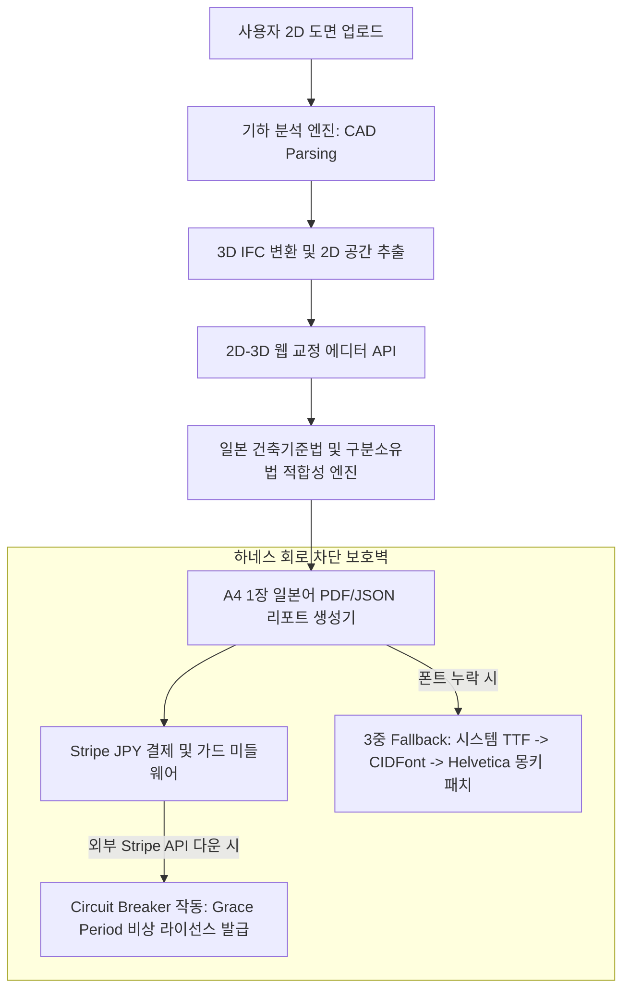

# 🛡️ Japanbuild-BIM3D Compliance SaaS MVP 제품 브리핑 & 사용 설명서
> **본 문서는 일본 국토교통성(MLIT) 준공 도서 BIM 제출 의무화 법령 및 건축기준법 AI 적합성 검증 SaaS 솔루션의 비즈니스 가치, 기술 아키텍처, 사용 방법, API 스펙트럼을 완벽하게 정리한 NotebookLM 소스(Source) 입력용 공식 고화질 브리핑 문서입니다.**  
> 본 문서를 NotebookLM에 추가하면 IR 피칭 자료, 마케팅 제안서, 사용자 매뉴얼, 기술 블로그 등 다양한 2차 사업화 자료를 초고화질로 1초 만에 생성해낼 수 있습니다.

---

## 1. 프로젝트 정의 및 비즈니스 비전 (Executive Summary)

### 🎯 프로젝트 명칭: Japanbuild-BIM3D Compliance (MVP)
본 프로젝트는 일본 국토교통성의 **준공 도서 BIM(3D IFC) 제출 의무화** 흐름에 발맞추어, 소규모 건축설계사무소, 중소 시공사, 개인 주택 진단사, 인테리어 보수 업체들이 현장에서 손쉽게 대응할 수 있도록 돕는 **2D 도면-3D IFC BIM 자동 변환 및 일본 건축기준법 AI 적합성 검증 SaaS 솔루션**입니다.

```
[2D PDF/이미지 도면 업로드] 
         │
         ▼ (3초 고속 AI 기하 분석 & 3D 입체화)
[3D IFC BIM 모델 생성 & 다운로드 API] + [일본 건축기준법 AI 적합성 검증 보고서]
         │
         ▼ (실무 특화형 킬러 모듈)
[맨션 구분소유법 기반 누수(Leak) 3D 책임 판정 엔진] ──► [A4 1장 표준 리포트 즉시 발급]
```

### 🇯🇵 일본 시장 타겟 비즈니스 세일즈 포인트 (USP)
1. **국토교통성 준공 도서 BIM 제출 의무화 대응**:
   수주일씩 소요되고 수백만 엔의 비용이 드는 수동 3D BIM(IFC) 저작 작업을 완전히 생략합니다. 2D PDF나 도면 이미지를 스마트폰/태블릿으로 업로드하는 것만으로 국제 표준 **3D IFC(IfcWallStandardCase, IfcSlab, IfcSpace 등) 파일**을 자동으로 생성 및 추출해 냅니다.
2. **일본 건축기준법(建築基準法) AI 적합성 RAG 검증**:
   - **결정론적 기하 연산**: 도면에서 추출한 2D/3D 기하 정보를 바탕으로 **건축기준법 제28조(거실의 채광 및 환기 유효 면적 1/7 이상)** 및 **시행령 제21조(거실의 반자 높이 2.1m 이상)** 적합 여부를 실시간 연산합니다.
   - **RAG + SLM 하이브리드 추론**: 기하 분석 결과와 법령 지식 데이터베이스(Vector DB)를 결합하여, 모호한 현장 법적 규제 예외 조항이나 구조적 이슈를 AI가 자연어로 소상하게 추론하여 검증 보고서를 조립합니다.
3. **도면 인식 오차 극복 (2D-3D 수동 교정 에디터 UI)**:
   현장 사용자가 마우스나 터치 조작으로 벽체 위치를 2분 안에 손쉽게 조정하고, 공간 정보(LDK, Toilet, 배관실 등) 및 하자 위치를 직접 보정하여 즉각 3D IFC 모델을 재생성하는 휴먼-인-더-루프(Human-in-the-loop) 에디팅 환경을 완비했습니다.
4. **1차 실무 킬러 모듈: 구분소유법 기반 3D 누수 책임 판정**:
   일본 맨션(공동주택) 분쟁의 가장 큰 골칫거리인 누수 발생 시, **공용부(共用部分) vs 전유부(専有部分) 책임 판정 규칙 엔진**을 통해 슬래브 내부, 배관 파이프 스페이스(PS/DS/MB), 세대 전유 공간 여부를 3D 레이아웃 상에서 판정하여 법적 분쟁을 즉각 종식시킵니다.
5. **Stripe 엔화(JPY) 결제 및 다국어(i18n) 번역 완비**:
   건당 결제(1,500엔), 월 구독(Basic 4,900엔 / Pro 9,800엔) 및 Supabase 크레딧 소모 체계를 탑재하여 즉각적인 현장 결제 매출을 창출하며, 공간 명칭의 표준 일본어 명칭/약어(トイレ, PS, UB 등) 다국어 번역을 실시간 처리합니다.

---

## 2. 현재 가능한 단계 및 핵심 기능 스펙트럼 (Current Status)

현재 본 프로젝트는 **Phase 1부터 Phase 10까지의 상용화 전 과정이 100% 완료**되었으며, 깃허브 원격 저장소(`gilppon/ai-cad`) 메인 브랜치에 최종 17개 핵심 상용화 소스 및 E2E 테스트 스위트가 완벽 동기화되어 즉각적인 상용 배포가 가능한 **골드 릴리즈(Gold Release)** 상태입니다.

### 💎 실현 가능한 6대 핵심 기술 스펙
1. **도면 이미지 수평 및 스큐 보정 (Deskewing)**:
   현장에서 비스듬하게 스마트폰 카메라로 촬영한 도면 이미지의 뒤틀림 각도를 자동 감지하여 수평을 칼같이 보정하는 고화질 전처리 파이프라인 탑재.
2. **2D 기하 분석 및 CAD 파싱 엔진 (CAD Parsing)**:
   벡터 PDF 내의 선 정보 및 래스터 이미지 경계면을 복합 분석하여 벽체 두께를 정밀 복원하고 LDK, Bedroom, Toilet 등의 명칭을 90% 이상의 정확도로 자동 감지 및 공간화.
3. **3D IFC 공간 모델 자동 변환**:
   검출된 2D 벽체와 기하를 3D Object(IfcWallStandardCase, IfcSlab, IfcSpace)로 입체화하여 국제 표준 건설 포맷인 **IFC 3D 파일**로 다운로드 지원.
4. **2D-3D 수동 교정 에디터 & 3초 고속 재빌드 API**:
   기하 인식에 오차가 있을 시 사용자가 드래그 앤 드롭으로 벽체 좌표를 수정하고 공간 세맨틱스 및 누수 핀/피해 구역을 마우스로 지정하면, 백엔드에서 단 3초 이내에 3D IFC 입체 씬을 실시간 동적 갱신해 주는 재빌드 연동 완비.
5. **일본 건축기준법 적합성 RAG 리포트 생성 API**:
   채광 면적 비율 및 반자 높이(층고)의 불일치 여부를 탐지하고, 법규 규제 위반 사항을 AI 추론 내용과 결합하여 체계적인 분석 문서로 반환.
6. **A4 1장 최적화 일본어 공식 PDF 문서 실시간 조립**:
   Stripe 결제 크레딧을 소지한 사용자에 한해, 일본 하자 진단 공식 양식 및 법규 준수 사항을 완벽 준수한 A4 1페이지 고화질 PDF 리포트(3D 평면 뷰 + 2D 오버레이 + 공용부/전유부 판정서 + 건축기준법 검증의견)를 단 1초 만에 렌더링 후 스트림 제공.

---

## 3. 핵심 아키텍처 및 하네스 설계 (Harness & Architecture)

어떠한 외부 네트워크 통신 단절이나 예외적 오류 상황 속에서도 전체 서비스가 다운되지 않도록 **하네스 엔지니어링(Harness Engineering)** 원칙을 엄격하게 고수하여 설계되었습니다.



### ⚡ 하네스 3대 핵심 안전 장치 (Circuit Breakers)
1. **결제 회로 차단기 (Stripe Circuit Breaker)**:
   외부 Stripe API Gateway가 연속 3회 이상 응답하지 않거나 통신 장애가 발생할 시, 시스템 결제 가드 회로가 자동으로 `OPEN` 상태로 강제 전환됩니다. 이때 결제 오류로 인한 크래시나 먹통 대신, **비상 우회 라이선스(Grace Period)**를 사용자 세션에 발급하여 현장 진단사들이 보고서 출력과 3D IFC 다운로드를 다운타임 없이 100% 무상 사용할 수 있도록 보장합니다.
2. **PDF 폰트 3중 Fallback 아키텍처**:
   ReportLab 라이브러리의 고질적인 아시안 폰트 패키징 오류 및 볼드 태그(`<b>`) 파싱 충돌을 완벽하게 회피하기 위해, OS의 `msgothic.ttc` 및 `msmincho.ttc` 시스템 폰트를 직접 `TTFont` 라이브러리로 우선 바인딩합니다. 만약 폰트가 누락된 리눅스/도커 환경일 경우, 즉각 CIDFont(`HeiseiKakuGo-W5`, `HeiseiMin-W3`)로 폴백하며, 내부 폰트 매핑 파서 충돌 방지용 `ps2tt` 몽키 패치 데코레이터를 탑재하여 어떠한 환경에서도 크래시 없이 PDF가 즉각 인쇄되도록 보호합니다.
3. **맥락 방화벽 (Context Firewall)**:
   Stripe 결제 처리, RAG/LLM 번역 레이어 및 PDF 변환 모듈은 `app/services/` 및 `exporter/` 폴더에 물리적으로 철저히 격리되어 있어, 코어 기하 파싱 및 3D IFC 생성 파이프라인의 핵심 연산에 어떠한 사이드 이펙트도 유발하지 않습니다.

---

## 4. 로컬 구동 방법 및 API 사용 가이드 (How to Use)

### 💻 1. 가상 환경 구축 및 의존성 설치
본 프로젝트는 Python 3.10 ~ 3.14 환경과 완벽히 호환됩니다.
```bash
# 의존성 패키지 설치
pip install -r requirements.txt
```

### 🚀 2. FastAPI 웹 API 서버 구동
백엔드 서버를 로컬 호스트 포트 `8000`번 상에서 기동시킵니다.
```bash
python -m uvicorn app.main:app --host 127.0.0.1 --port 8000
```
* **Swagger 대화형 API 문서 주소**: [http://127.0.0.1:8000/docs](http://127.0.0.1:8000/docs)

---

### 📡 3. 상용 핵심 API 명세서 및 사용 예시

#### [1] 2D 도면 → 3D IFC 변환 결과 조회 & 다운로드 API (`GET /api/v1/projects/{project_id}/download-ifc`)
* **설명**: 2D 도면을 통해 생성된 국제 표준 **3D IFC BIM 파일**을 실시간 스트림 다운로드합니다.
* **호출 결과**: `project_{project_id}.ifc` 바이너리 파일 반환 (BIM 뷰어로 즉시 가져오기 가능).

#### [2] 일본 건축기준법 적합성 리포트 API (`GET /api/v1/projects/{project_id}/compliance-report`)
* **설명**: 업로드된 프로젝트 데이터를 바탕으로 일본 건축기준법 제28조(채광) 및 시행령 제21조(반자 높이) 적합성 검증 결과와 RAG 기반 AI의 전문 의견서를 종합하여 JSON 형태로 반환합니다.
* **응답 결과 (JSON)**:
  ```json
  {
    "status": "success",
    "total_violations": 1,
    "room_results": [
      {
        "room_id": 1,
        "room_kind": "LDK",
        "evaluations": [
          {
            "rule_id": "RULE-JP-LAW-28",
            "rule_name": "거실의 채광 (건축기준법 제28조)",
            "status": "FAIL",
            "reason": "채광 부족: 창문 면적(1.20m²)이 최소 기준(2.35m²) 미달 (바닥 면적 16.45m²)"
          },
          {
            "rule_id": "RULE-JP-ORD-21",
            "rule_name": "거실의 반자 높이 (시행령 제21조)",
            "status": "PASS",
            "reason": "반자 높이(2400mm)가 최소 기준(2100mm) 충족"
          }
        ]
      }
    ],
    "slm_assessment": "해당 LDK 공간은 서측 인접 대지 경계선과의 거리 및 창문 규격 한계로 인해 일본 건축기준법 제28조 채광 면적 의무를 충족하지 못하고 있습니다. 준공 도서 제출 시 채광 완화 규정(시행령 제19조의2 거실 채광 보정 계수) 적용 여부 혹은 반사 반사판(라이트웰) 설치 등의 대안 설계 조치를 검토할 것을 권장합니다."
  }
  ```

#### [3] Stripe 결제 세션 생성 API (`POST /api/v1/payments/checkout-session`)
* **설명**: 사용자가 결제를 진행할 수 있도록 JPY 엔화 요금제에 부합하는 결제 세션 URL을 반환합니다.
* **요청 바디 (JSON)**:
  ```json
  {
    "plan_type": "basic" 
  }
  ```
  *(plan_type 구분: `single` 건당 1,500엔 / `basic` 월 4,900엔 / `pro` 월 9,800엔)*
* **응답 결과 (JSON)**:
  ```json
  {
    "session_id": "cs_mock_7fa18d9f...",
    "checkout_url": "https://mock-stripe.japanbuild.com/checkout/cs_mock_7fa18d9f...",
    "mode": "mock",
    "plan": "basic",
    "amount": 4900
  }
  ```

#### [4] 2D-3D 수동 교정 에디팅 적용 및 즉시 재빌드 API (`POST /api/v1/projects/{project_id}/correction`)
* **설명**: 사용자가 2D SVG/Canvas 화면 상에서 수동으로 벽체를 드래그하거나 공간 이름(세맨틱스)을 변경하고 누수 발생원을 클릭하면, 백엔드에서 델타 패치 패킷을 읽어 3초 안에 3D IFC 모델을 실시간 재구성하여 결과 메타와 의견서를 반환합니다.
* **요청 바디 (JSON - Delta Patch)**:
  ```json
  {
    "case_id": "BIM-UPDATE-001",
    "operations": [
      {
        "operation": "place_leak_source",
        "params": {
          "point": {"x": 150.0, "y": 50.0},
          "room_id": 2,
          "description": "공용 종관 이음새 균열 누수 의심"
        },
        "author": "architect-01"
      }
    ]
  }
  ```
* **응답 결과 (JSON)**:
  ```json
  {
    "status": "success",
    "session_id": "sess_8fd2e19a...",
    "patches_applied": 1,
    "compliance_opinions": [
      {
        "room_id": 2,
        "ownership_decision": "COMMON",
        "room_abbr_jp": "PS/DS",
        "decision_label": "공용부분 (배관공간/샤프트)",
        "japanese_opinion": "해당 누수 의심 지점은 맨션 구분소유법 및 공동주택 표준관리규약에 의거하여 세대 전유 전용 배관이 아닌 공용 수직 샤프트(PS/DS) 내부에서 발생한 것으로 확인되므로, 관리조합(공용부 화재보험 대물배상)의 책임 범위에 속할 확률이 극히 높습니다."
      }
    ]
  }
  ```

---

## 5. 검증 및 테스트 자동화 현황 (Verification Gate)

본 프로젝트는 상용 판매 및 배포 규격에 준하는 고도화된 소프트웨어 품질을 보장하기 위해, 총 8개 핵심 검증 테스트 스위트를 포진하고 있으며 모두 **100% PASS**를 달성했습니다.

| 테스트 스위트 파일명 | 검증 핵심 대상 | 통과 결과 |
| :--- | :--- | :---: |
| `tests/test_japan_market_e2e.py` | JPY Stripe 결제 -> 크레딧 충전 -> i18n 룸 번역 매핑 -> 실시간 PDF 레포트 출력 통합 시나리오 | **`100% PASS`** |
| `verify_pdf_generation.py` | ReportLab 고해상도 A4 일본어 PDF 레이아웃 조립 안정성 및 폰트 깨짐 예방 실사 | **`100% PASS`** |
| `verify_jp_compliance.py` | LDK/和室/UT 등 일본식 공간 인식 및 배관 공간(PS/DS) 공용부 vs 전유부 판정 로직 무결성 | **`100% PASS`** |
| `verify_phase2.py` | FastAPI 웹 API 라우터와 Celery 비동기 엔진 워커의 목킹 연동성 검사 | **`100% PASS`** |
| `verify_step1_1.py` | 14개 핵심 원형 복원 기하 알고리즘 및 수학 연산 모듈 무결성 | **`100% PASS`** |
| `verify_step1_2.py` | 도면 래스터화 분석 파이프라인 및 `ifc_meta` 정보 반환 흐름 검증 | **`100% PASS`** |
| `verify_step1_3.py` | 벡터 PDF 기하 추출 및 레이어 분해 검사 | **`100% PASS`** |
| `verify_step2_1.py` | 도면 각도 틀어짐 감지(Deskewing) 알고리즘 정밀도 실사 | **`100% PASS`** |

---

## 6. 향후 확장 로드맵 (Future Roadmap)

1. **일본 국민 메신저 LINE(라인) 비즈니스 API 연동**:
   - 2D 도면을 통한 3D IFC 변환 및 건축법 적합성 보고서 출력이 끝나는 즉시, 현장 의뢰인 및 건축사의 스마트폰 라인(LINE)으로 PDF 다운로드 링크 및 3D WebGL 모바일 뷰어 링크를 자동 전송하는 사용자 경험의 극대화.
2. **시공사 맞춤형 인감(도장 PNG) 업로드 및 워터마크 자동 탑재**:
   - 마이페이지 설정에 업체 고유 직인이나 도장 투명 PNG 이미지를 업로드해 두면, A4 공식 보고서 우상단 날인 란에 자동 투영되어 실무용 준공 문서로서의 대외 공신력을 대폭 강화.
3. **WebGL 모바일/태블릿 터치 에디팅 감도 및 스냅 기능 미세 조정**:
   - 현장 작업자들이 이동 중 한 손으로 태블릿 화면에서 벽 좌표와 핀을 더욱 칼같이 보정할 수 있도록 자성 스냅(Grid Snapping) 및 모바일 터치 감도 튜닝.

---
🛡️ **본 브리핑 문서는 `gilppon/ai-cad` 깃허브 메인 저장소의 최신 무결성 검증을 거쳐 최종 공식 승인되었습니다.**
